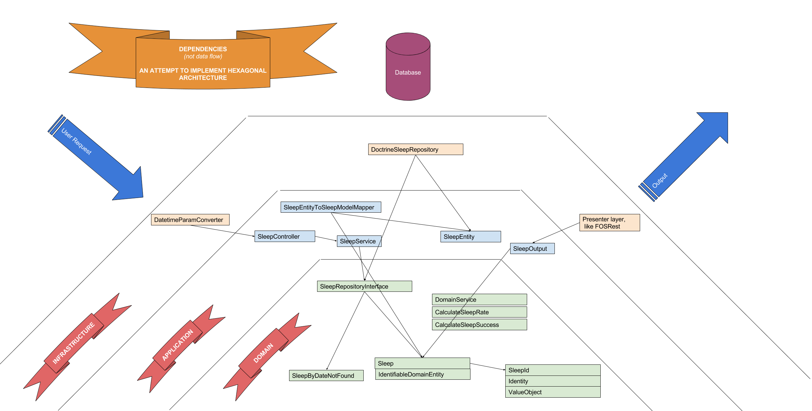

[sleeper](https://sleeper-prod.herokuapp.com/)
=======

What is it?
-
This API suppose to analyze sleep data and provide some analytics regarding it.

The idea behind this project is to master TDD skill and learn modern approaches like DDD & Hexagonal architecture.
These 2 approaches are intended to reduce code coupling and make sure dependencies go only in one direction - in direction of domain.

Hexagonal style dependencies explanation
-

Earned experience
- 

Application
- 👌 layered architecture ([DDD](https://leanpub.com/ddd-in-php) or [hexagonal](http://www.youtube.com/playlist?list=PLviuozY4UHkkLGVVUbUDSyvcnaVox2cXo))
- 👌 setting up whole project from bare framework according to [Clean code](https://www.amazon.com/Clean-Code-Handbook-Software-Craftsmanship/dp/0132350882)
- 👌 Dependency Inversion principle
- 👌 TDD approach -- writing tests first and then production code. When I installed test coverage tool, I found out that all domain and application are covered with tests, with no additional effort
- 👌 code structures like Value Objects, Models, Services, and where/when to use them
- 👌 using Assertions in codebase to assert use scenarios 
- 👌 domain services are operations on domain building blocks
- lightweight bus (?)
- CQRS
- FOS REST bundle
- get rid of namespaces like `.../ValueObject` and etc. According to the book, namespaces should reflect domain, not building blocks

Infrastructure  
- 👌 CI with CircleCI -- it runs my tests and shows nice little badge on main page of repo
- 👌 CD with Heroku 
- 👌 SQLite - quite nice for development, just perfect for tests
- 👌 nice composer aliases for commands, so I can run all the tests or install the whole project with one simple command
- 👌 setting up test coverage tool (nothing special, just using PHPUnit + XDebug)
- 👌 setting up contract tests with test database and [fixtures](https://github.com/hautelook/AliceBundle)
- Docker (Compose) to wrap codebase in the container and database in separate container
- Kubernetes to be able to scale
- Swagger docs

Commands
-

- `composer install` -- install the API

- `composer run` -- start the server

- `composer stop` -- stop the server

- `composer test` -- run all the tests

- `composer test:unit` -- run unit tests (fast)

- `composer test:contract` -- run contact test based on Symfony crawler (slow)

- `composer test:coverage` -- test coverage (requires XDebug installed)

- `composer test:watch` -- watch unit tests (sorry, OSX + fswatch only)

Prerequisites
-

- `apt install php7.1-xdebug` -- XDebug needed for test coverage, that's how to install it for Ubuntu

- `brew install php71-xdebug` -- XDebug install for OSX

- `brew install fswatch` -- file system watcher for OSX
