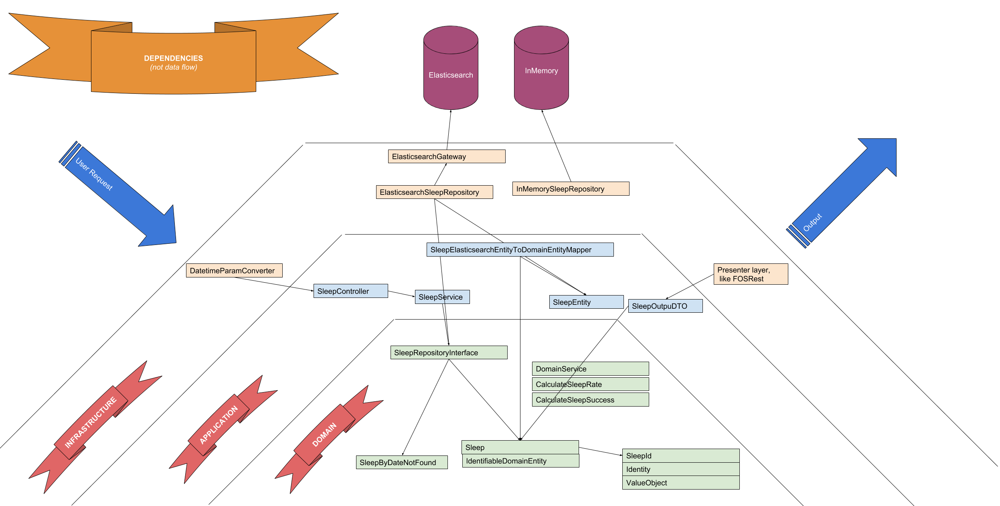

sleeper
=======

What is it?
-
This API suppose to analyze sleep data which has been retrieved by sleep tracking device.

the idea behind this project is to master TDD skill and learn modern approaches like DDD & Hexagonal architecture.
These 2 approaches are intentended to reduce code coupling and make sure dependencies go only in one direction - in direction of domain.

Hexagonal style dependencies explanation
-

Earned experience
- 

Application
- 👌 layered architecture ([DDD](https://leanpub.com/ddd-in-php) or [hexagonal](http://www.youtube.com/playlist?list=PLviuozY4UHkkLGVVUbUDSyvcnaVox2cXo))
- 👌 setting up whole project from bare framework according to [Clean code](https://www.amazon.com/Clean-Code-Handbook-Software-Craftsmanship/dp/0132350882)
- 👌 Dependency Inversion principle
- 👌 TDD approach -- writing tests first and then production code. When I installed test coverage tool, I found out that all domain and application are covered with tests, with no additional effort
- 👌 code structures like Value Objects, Models, Services, and where/when to use them
- Domain services
- Lightweight bus
- CQRS
- FOS REST bundle
- get rid of namespaces like `.../ValueObject` and etc. According to the book, namespaces should reflect domain, not building blocks

Infrastructure  
- 👌 SQLite 
- 👌 nice composer aliases for commands
- 👌 setting up test coverage tool (nothing special, just using PHPUnit + XDebug)
- Swagger docs

Commands
-

- `composer install` -- install the API

- `composer run` -- start the server

- `composer stop` -- stop the server

- `composer test` -- run the tests

- `composer test:coverage` -- test coverage (requires XDebug installed)

- `composer test:watch` -- watch unit tests (sorry, OSX + fswatch only)

Prerequisites
-

- `apt install php7.1-xdebug` -- XDebug needed for test coverage, that's how to install it for Ubuntu

- `brew install php71-xdebug` -- XDebug install for OSX

- `brew install fswatch` -- file system watcher for OSX
